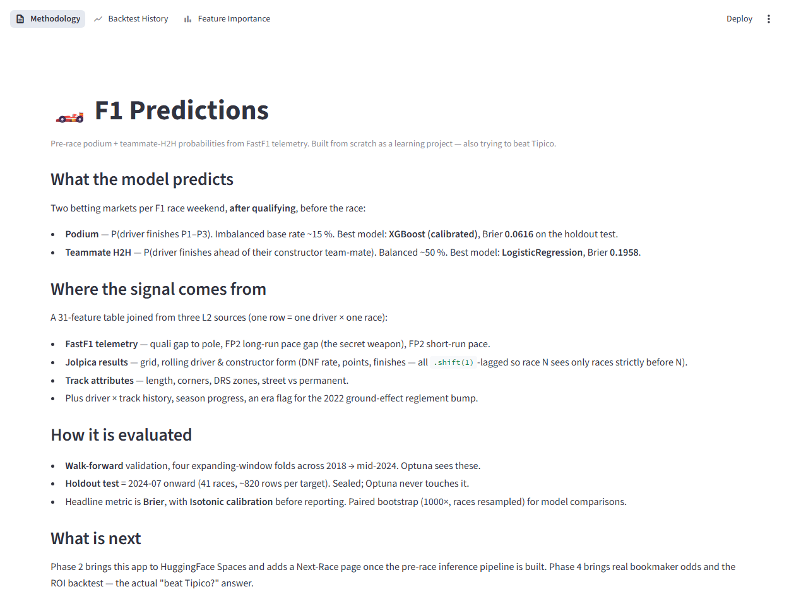

# F1 Predictions

Probabilistic Formula 1 betting models — podium, team-mate H2H, the four
qualifying markets, full grid & finish order, and DNF risk — built from scratch
as a learning project and a long-run attempt to beat Tipico.

**Live demo:** <https://huggingface.co/spaces/d0kj4/F1_Prediction>



## Status

| Phase | Scope | Status |
|---|---|---|
| 0 | Setup, tooling, FastF1 smoke | done |
| 1 | MVP — pre-race podium + teammate H2H, calibrated, beats the top-3-quali baseline | done |
| 2 | Streamlit multi-page app on HuggingFace Spaces | done |
| 3 | Next-race predict pipeline (Saturday-after-quali forecast, sprint-safe) | done |
| 4 | Manual odds + Kelly stakes + ROI loop; pre-quali model (4 qualifying markets, 2 timing modes) | done |
| 5 | Ranking model (grid & finish order) + dedicated DNF sub-model | done |
| 5.3–5.9 | Feature-engineering wave — overtaking index, team-execution residual, teammate quali gap, wet-skill delta, form momentum | done |
| next | Collect real ROI over the 2026 season — the actual "beat Tipico?" answer; live in-race stays open | in progress |

> Several extensions are documented **negative results** kept on purpose
> (pre-quali→podium composition, full-race ranking vs. grid, the DNF sub-model):
> the recurring lesson is that the starting grid carries most of the race-day
> signal. See [`PLANNING.md`](PLANNING.md) §13–23.

**Phase-1 headline:** calibrated XGB+LGBM ensemble reaches Brier **0.0629**,
beating the F1-domain "top-3-quali = podium" baseline at **0.0752**
(paired-bootstrap 95 % CI on Δ Brier: `[-0.0195, -0.0057]`). All tree models
have **ECE < 0.05** after isotonic calibration.

## Stack

- **Python 3.11+**, [uv](https://github.com/astral-sh/uv) for env management,
  [`just`](https://github.com/casey/just) as the cross-platform pipeline runner
- **FastF1** (telemetry, quali, race, FP2 long-run pace) +
  **Jolpica-F1** (Ergast fork; standings, schedule, classifications) +
  **Open-Meteo** (race-weekend weather forecast)
- **XGBoost** + **LightGBM** for the podium classifier,
  **scikit-learn LogisticRegression** for the teammate H2H,
  **isotonic regression** for calibration (mandatory after `scale_pos_weight`)
- **Optuna** (TPE, walk-forward objective with stability penalty) for HP search,
  **MLflow** for experiment tracking
- **Streamlit** multi-page UI deployed to **HuggingFace Spaces** (Docker)

## Quickstart

```bash
# 1. install deps
uv sync --all-groups

# 2. smoke-test the three data sources
just smoke

# 3. backfill 2018–current (schedules, results, FastF1, weather)
just ingest-schedule
just ingest-all
just build-l2
just build

# 4. baseline -> tune -> final calibrated eval (podium target)
just train-baseline
just tune-mvp 50 podium
just final-eval podium
just importance podium

# 5. run the Streamlit app locally
just app
```

See [`justfile`](justfile) for every available target.

## Architecture (4-layer Medallion-light)

```
SOURCES → L1 RAW → L2 PROCESSED → L3 FEATURES → L4 MODELS
```

One row per `(race_id, driver_id)` at L3 — model-ready, ~31 numeric features
plus `track_id` as a categorical. The pre-race contract is "every feature must
be knowable on Saturday evening, after qualifying, before the race", enforced
by `tests/test_no_leakage.py`. Cross-track comparability is preserved by
emitting **gap** features (gap to pole, gap to fastest FP2 long-run) rather
than raw lap times.

Full design — feature engineering, validation strategy, model stack, MLOps,
risk register — is in [`PLANNING.md`](PLANNING.md).

## Repo layout

```
src/
  ingest/    fastf1_ingest.py, jolpica_ingest.py, openmeteo_ingest.py
  process/   L1 RAW -> L2 PROCESSED parquet
  features/  L2 -> L3 model-ready table (build.py, baseline.py)
  models/    baseline.py, mvp.py, tune.py, final_eval.py
  eval/      metrics, walk_forward, calibration, importance (SHAP)
  utils/     paths, tracks, race_inventory
app/         Streamlit multi-page UI
deploy/hf/   HuggingFace Spaces (Dockerfile, runtime requirements, Space README)
data/        raw / processed / features / reference (parquet + JSON; FastF1 cache gitignored)
models/      .pkl + CHANGELOG.md + CURRENT.json
predictions/ per-race calibrated probabilities (CSV)
tests/       feature tests, no-leakage guard
```

## License

MIT — see [LICENSE](LICENSE).
